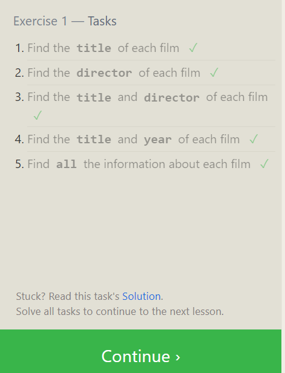
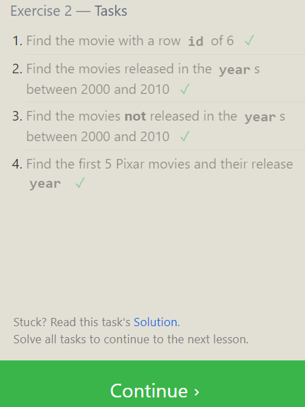
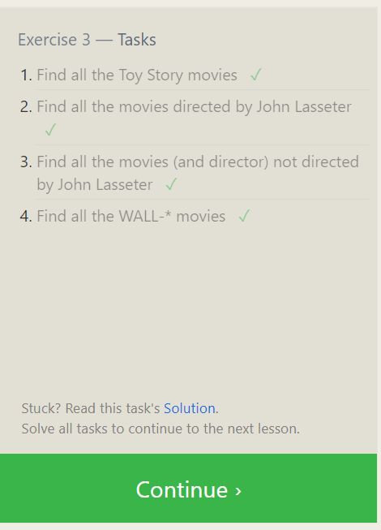
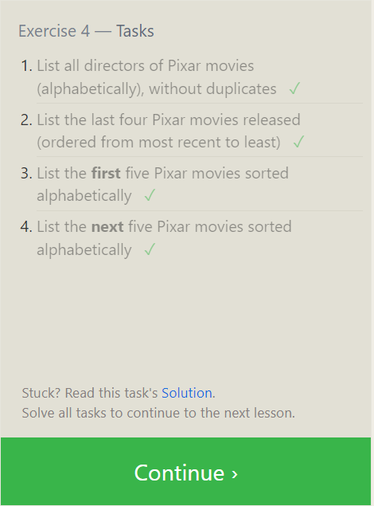
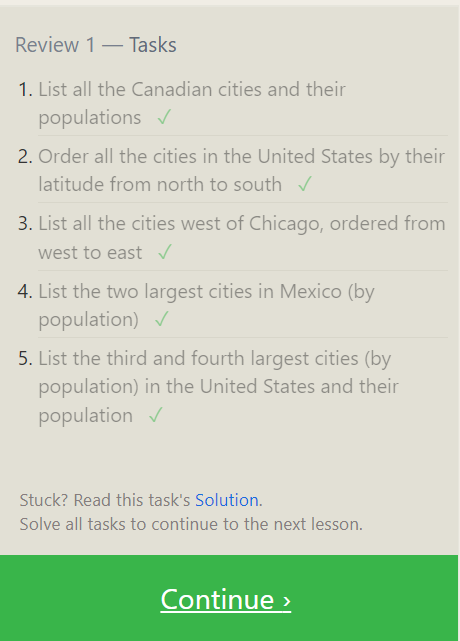

1. Find the title of each film

```sql
SELECT title FROM movies;
```

2. Find the director of each film

```sql
SELECT director FROM movies;
```

3. Find the title and director of each film ✓

```sql
SELECT title , director  FROM movies;
```

4. Find the title and year of each film

```sql
SELECT title , year  FROM movies;
SELECT * FROM movies;
```

5. Find all the information about each film

```sql

SELECT * FROM movies;
```



Excercise 2

1.Find the movie with a row id of 6

```sql
SELECT * FROM movies
where id =6;
```

2.  Find the movies released in the years between 2000 and 2010

```sql
 SELECT * FROM movies
where year between 2000 and 2010;
```

3.Find the movies not released in the years between 2000 and 2010

```sql
SELECT * FROM movies
where year not between 2000 and 2010;
```

4.Find the first 5 Pixar movies and their release year

```sql
SELECT title, year FROM movies
WHERE year <= 2003;
```



Excercise 3

1.Find all the Toy Story movies

```sql
SELECT title FROM movies where title LIKE "Toy Story%";
```

2. Find all the movies directed by John Lasseter

```sql
SELECT title FROM movies where director LIKE "john lasseter";
```

3. Find all the movies (and director) not directed by John Lasseter

```sql
SELECT title, director FROM movies where director not LIKE "john lasseter";
```

4. Find all the WALL-\* movies

```sql
select title from movies where title LIKE "WALL-%"
```



Excercise 4

1. List all directors of Pixar movies (alphabetically), without duplicates

```sql

SELECT DISTINCT director
FROM movies
ORDER BY director;
```

2. List the last four Pixar movies released (ordered from most recent to least)

```sql
SELECT *
FROM movies
order by year desc
limit 4;
```

3. List the first five Pixar movies sorted alphabetically

```sql
SELECT *
FROM movies
order by title
limit 5;
```

4. List the next five Pixar movies sorted alphabetically

```sql
SELECT *
FROM movies
order by title
limit 5 offset 5;
```



1. List all the Canadian cities and their populations

```sql
SELECT city , population FROM North_american_cities where country = 'Canada';
```

2. Order all the cities in the United States by their latitude from north to south

```sql

select city from North_american_cities where country= 'United States' order by latitude desc
```

3. List all the cities west of Chicago, ordered from west to east

```sql
select city from North_american_cities where longitude < (select longitude from North_american_cities where city= 'Chicago') order by
longitude asc ;
```

```sql
select * from North_american_cities where longitude < -87.5333
order by longitude asc;
```

4. List the two largest cities in Mexico (by population)

```sql
select city from North_american_cities where country = 'Mexico' order by population desc limit 2;
```

5. List the third and fourth largest cities (by population) in the United States and their population

select city from North_american_cities
where country = 'United States'
order by population desc
limit 2 offset 2;



Excercise 6

1.Find the domestic and international sales for each movie

```sql
SELECT * from Movies inner join Boxoffice on Movies.id= Boxoffice.Movie_id;
```

2.Show the sales numbers for each movie that did better internationally rather than domestically

```sql
select title, Domestic_sales, International_sales
from Boxoffice
inner join Movies
on Movies.id = Boxoffice. Movie_id
where International_sales > Domestic_sales;
```

3. List all the movies by their ratings in descending order

```sql
select Title, Rating from Boxoffice
inner join Movies
on Movies.id = Boxoffice.Movie_id
order by Rating desc
```


