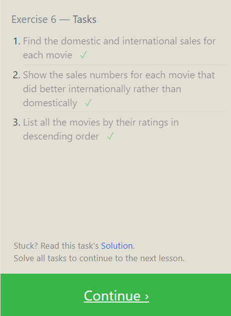
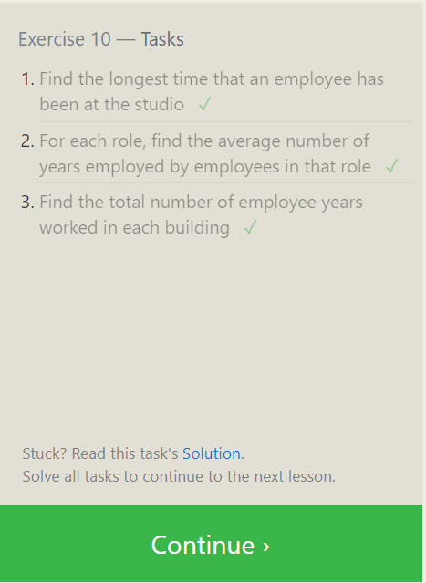

## Excercise 1

1. Find the title of each film

```sql
SELECT title
FROM movies;
```

2. Find the director of each film

```sql
SELECT director
FROM movies;
```

3. Find the title and director of each film ✓

```sql
SELECT title , director
FROM movies;
```

4. Find the title and year of each film

```sql
SELECT title , year
FROM movies;
SELECT * FROM movies;
```

5. Find all the information about each film

```sql

SELECT * FROM movies;
```


## Excercise 2

1.Find the movie with a row id of 6

```sql
SELECT * FROM movies
where id =6;
```

2.  Find the movies released in the years between 2000 and 2010

```sql
 SELECT * FROM movies
where year between 2000 and 2010;
```

3.Find the movies not released in the years between 2000 and 2010

```sql
SELECT * FROM movies
where year not between 2000 and 2010;
```

4.Find the first 5 Pixar movies and their release year

```sql
SELECT title, year
FROM movies
WHERE year <= 2003;
```


## Excercise 3

1.Find all the Toy Story movies

```sql
SELECT title
FROM movies
where title LIKE "Toy Story%";
```

2. Find all the movies directed by John Lasseter

```sql
SELECT title
FROM movies
where director LIKE "john lasseter";
```

3. Find all the movies (and director) not directed by John Lasseter

```sql
SELECT title, director
FROM movies
where director not LIKE "john lasseter";
```

4. Find all the WALL-\* movies

```sql
select title
from movies
where title LIKE "WALL-%"
```


## Excercise 4

1. List all directors of Pixar movies (alphabetically), without duplicates

```sql

SELECT DISTINCT director
FROM movies
ORDER BY director;
```

2. List the last four Pixar movies released (ordered from most recent to least)

```sql
SELECT *
FROM movies
order by year desc
limit 4;
```

3. List the first five Pixar movies sorted alphabetically

```sql
SELECT *
FROM movies
order by title
limit 5;
```

4. List the next five Pixar movies sorted alphabetically

```sql
SELECT *
FROM movies
order by title
limit 5 offset 5;
```


## Excercise 5

1. List all the Canadian cities and their populations

```sql
SELECT city , population
FROM North_american_cities
where country = 'Canada';
```

2. Order all the cities in the United States by their latitude from north to south

```sql

select city
from North_american_cities
where country= 'United States'
order by latitude desc
```

3. List all the cities west of Chicago, ordered from west to east

```sql
select city
from North_american_cities
where longitude < (select longitude from North_american_cities where city= 'Chicago')
order by
longitude asc ;
```

```sql
select * from North_american_cities
where longitude < -87.5333
order by longitude asc;
```

4. List the two largest cities in Mexico (by population)

```sql
select city
from North_american_cities
where country = 'Mexico'
order by population desc limit 2;
```

5. List the third and fourth largest cities (by population) in the United States and their population

```sql
select city from North_american_cities
where country = 'United States'
order by population desc
limit 2 offset 2;
```


## Excercise 6

1.Find the domestic and international sales for each movie

```sql
SELECT * from Movies
inner join Boxoffice
on Movies.id= Boxoffice.Movie_id;
```

2.Show the sales numbers for each movie that did better internationally rather than domestically

```sql
select title, Domestic_sales, International_sales
from Boxoffice
inner join Movies
on Movies.id = Boxoffice. Movie_id
where International_sales > Domestic_sales;
```

3. List all the movies by their ratings in descending order

```sql
select Title, Rating from Boxoffice
inner join Movies
on Movies.id = Boxoffice.Movie_id
order by Rating desc
```



## Excercise 7

1.Find the list of all buildings that have employees

```sql
SELECT distinct Building_name
from Buildings
join Employees
on Buildings.Building_name= Employees.Building;

```

2. Find the list of all buildings and their capacity

```sql
select * from Buildings
```

3. List all buildings and the distinct employee roles in each building (including empty buildings)

```sql
select  distinct Building_name, Role
from Buildings
left join Employees
on Building_name =Building;
```


## Excercise 8

1. Find the name and role of all employees who have not been assigned to a building

```sql
select Name, Role
from Employees
where Building is null;

```

2. Find the names of the buildings that hold no employees

```sql
select * from Buildings
left join Employees
on Building=Building_name
where Name is null;

```


## Excercise 9

1.List all movies and their combined sales in millions of dollars

```sql
select Title,  (Domestic_sales + International_sales) /1000000
as combined
from Boxoffice
inner join Movies
on Id = Movie_id;
```

2. List all movies and their ratings in percent

```sql
select Title, (Rating)*10
from Movies
inner join Boxoffice
on id= Movie_id;
```

3. List all movies that were released on even number years

```sql
select Title
from Movies
where Year %2==0;
```


## Excercise 10

1. Find the longest time that an employee has been at the studio

```sql

SELECT MAX(Years_employed)
FROM Employees
WHERE Years_employed ;
```

2. For each role, find the average number of years employed by employees in that role

```sql
SELECT Role, AVG(Years_Employed) AS AvgYearsEmployed
FROM Employees
GROUP BY Role;
```

3.Find the total number of employee years worked in each building

```sql
select Building, SUM(Years_employed)
from Employees
group by Building

```



## Excercise 11

1. Find the number of Artists in the studio (without a HAVING clause)

```sql
SELECT Count(Role)
FROM employees
where Role= "Artist";
```

2. Find the number of Employees of each role in the studio

```sql
select Role, count(Years_employed)as count
from Employees
where Years_employed
group by Role;
```

3. Find the total number of years employed by all Engineers

```sql

select Role , sum(Years_employed) as sum
from Employees
where Role Like "Engineer"

//where role = "Engineer"
```


## Excercise 12

1. Find the number of movies each director has directed

```sql
select Director, count(Director)
as count
from Movies
group by Director;
```

2. Find the total domestic and international sales that can be attributed to each director

```sql
select distinct Director, (Domestic_sales+International_sales) as com
from Movies
inner join Boxoffice
on id = Movie_id
group by Director;
```


## Excercise 13

1. Add the studio's new production, Toy Story 4 to the list of movies (you can use any director)

```sql

insert into Movies( Id, Title, Director, Year, Length_minutes)
Values( 4, "Toy Story 4", "Neha Reddy", 2024, 120);
```

2. Toy Story 4 has been released to critical acclaim! It had a rating of 8.7, and made 340 million domestically and 270 million internationally. Add the record to the BoxOffice table.

```sql
insert into Boxoffice(Movie_Id, Rating,Domestic_sales,International_sales)
values (4, 8.7, 340*1000000, 270*1000000)
```


## Excercise 14

1. The director for A Bug's Life is incorrect, it was actually directed by John Lasseter

```sql
select * from Movies
where id =2
update Movies
set Director = "John Lasseter"
where Title = "A Bug's Life"
```

```sql
update Movies
set Director = "John Lasseter"
where Title = "A Bug's Life";
```

2. The year that Toy Story 2 was released is incorrect, it was actually released in 1999

```sql
select * from Movies
where id =3
update Movies
set Year= 1999
where Title = "Toy Story 2"
```

```sql
update Movies
set Year= 1999
where Title = "Toy Story 2"
```

3. Both the title and director for Toy Story 8 is incorrect! The title should be "Toy Story 3" and it was directed by Lee Unkrich

```sql
update Movies
set Director = "Lee Unkrich", Title= "Toy Story 3"
where Title = 'Toy Story 8';
```


## Excercise 15

1. This database is getting too big, lets remove all movies that were released before 2005.

```sql
select * from Movies

```

```sql
delete from Movies
where year < 2005;
```

2. Andrew Stanton has also left the studio, so please remove all movies directed by him.

```sql
delete from Movies
where Director = "Andrew Stanton";
```


## Excercise 16

1. Create a new table named Database with the following columns:
   – Name A string (text) describing the name of the database
   – Version A number (floating point) of the latest version of this database
   – Download_count An integer count of the number of times this database was downloaded
   This table has no constraints.

```sql
create table Database(
Name text,
Version Float,
Download_count Integer)
```


## Excercise 17

1. ercise 17 — Tasks
   Add a column named Aspect_ratio with a FLOAT data type to store the aspect-ratio each movie was released in.

```sql
alter table Movies
add Aspect_ratio Float;
```

2. Add another column named Language with a TEXT data type to store the language that the movie was released in. Ensure that the default for this language is English.

```sql
alter table Movies
add Language Text
default "English";
```


## Excercise 18

1. We've sadly reached the end of our lessons, lets clean up by removing the Movies table

```sql
Drop table Movies;
```

2. And drop the BoxOffice table as well

```sql

drop table BoxOffice;
```


