Database software is software that is designed to create databases and to store, manage, search, and extract the information contained within them.

The software also handles data storage, backup and reporting, multi-access control, and security.

# What is database?

- Database is a software which is used to store the data
- Cloud is preesnt in the data
- Cloud is renting pc
- Amazon leads $100 billion cloud market
- Netflix is using AWS

not cloud providers- google drive, one drive, drop box,

## Why we should not buy?

1. high initial cost
2. storage space
3. Ac
4. Power bill
5. maintenance
6. spare parts
7. generator
8.

## Disaster management

1. We wont keep our servers where disasters occur

2. Some disasters we cant avoid so we keep the back up.

3. keep the back up data where it is safe it might be the other country also

4. We cannot go and ask for backup in the other countries , so we use MNC's, Mncs can ask for backup or rent.

Windows and Mac!!! has the problem i.e we are paying the licensce fee, sql cannot be runned on linux

> Most used Os is Linux

- free
- open source - boat sink example, if boat has the hole , everyone die so it is their responsibility for all to solve the problem
- secure- fixes the bug
- smaller footprint - lesser ram you use, lesser money

distrose- alpine 256mb where as windows is 40gb

## Scaling

- Scaling, in simple terms, refers to the ability of a system, service, or application to handle an increasing amount of work or traffic as demand grows, without breaking or becoming slow or unstable.

- vertical scaling: More ram, CPU power,storage space, network bandwidth

- Vertical scaling involves adding more resources (such as upgrading hardware components) to an existing system to increase its capacity

- Horizontal: Adding more computers

- Horizontal scaling involves adding more instances or copies of a system to distribute the workload across multiple machines.

- Offices uses which ever is cheaper.

- The choice in the office between vertical and horizontal scaling depends on factors such as the nature of the workload, budget constraints, existing infrastructure, and scalability requirements.

### Autoscaling

Autoscaling solves this problem by `automatically adjusting the number of servers  or resources` allocated to your website based on real-time demand. When traffic increases, autoscaling automatically adds more servers or resources to handle the load. And when traffic decreases, it removes unnecessary servers or resources to save costs.

when load is mre than 80 % aws decides to add an other pc

### how will you go bankrupt, if autoscaling is on?

DDoS Attack:

Identify ddos:

1. filtering
2. captcha
3. ip address filtering

Divert the flow

when the slow attacks happen, server always does request time out, set the time limit

## Database why?

Ram is temporary , volatile

Hard disk is permanent , slow

If people are demanding the data more keep the copy in the ram.

In that case reading speed increases.

If we open the game, it loads because, it copies the data from the hard disk to ram.

Bottleneck is HDD (Hard disk)

Instead of the HDD people are using the SSD because hdd is slow.

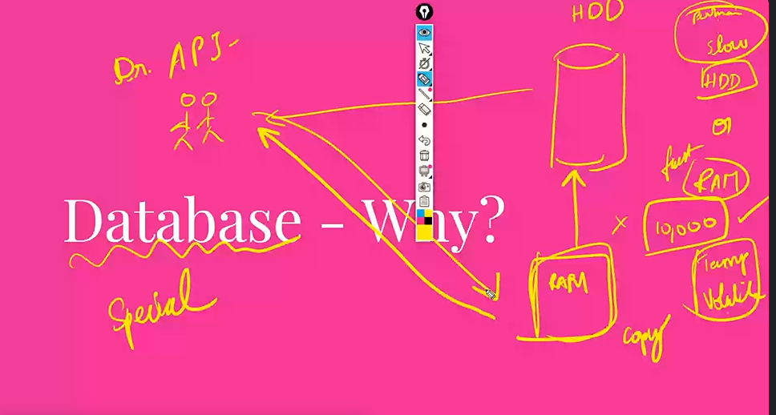

1. frequently asked it will have it in the ram
2. Querying becomes easier
3. CRUD : easy
4. Backups are inbuilt
5. Undo- easily(time limit)
6. performance

## SQL vs NO SQL

| Relational (Tables with Rows and Columns)            | Columns) Various (Document, Key-Value, Columnar, Graph, etc.)                    |
| ---------------------------------------------------- | -------------------------------------------------------------------------------- | --- |
| Complex Queries, Transactions, Structured Data       | High Volume, High Velocity, Unstructured or Semi-Structured Data                 |
| tabular format                                       | no tables                                                                        |     |
| MySQL, PostgreSQL, SQL Server                        | MongoDB, Cassandra, Redis, Couchbase                                             |
| ACID (Atomicity, Consistency, Isolation, Durability) | Eventual Consistency (May sacrifice consistency for performance and scalability) |

|

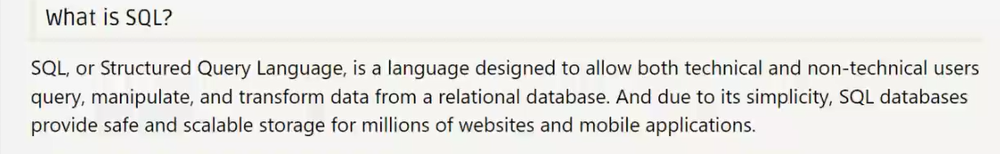

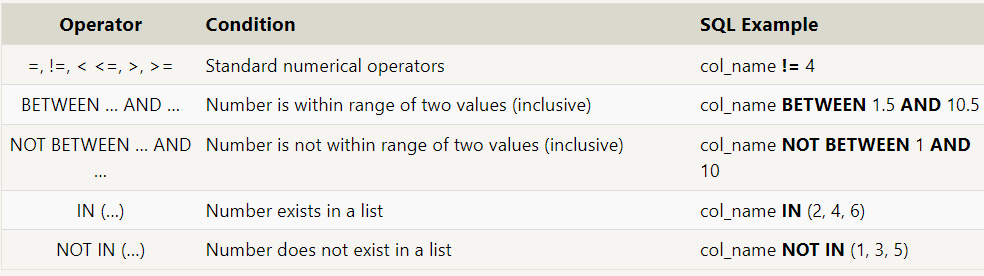

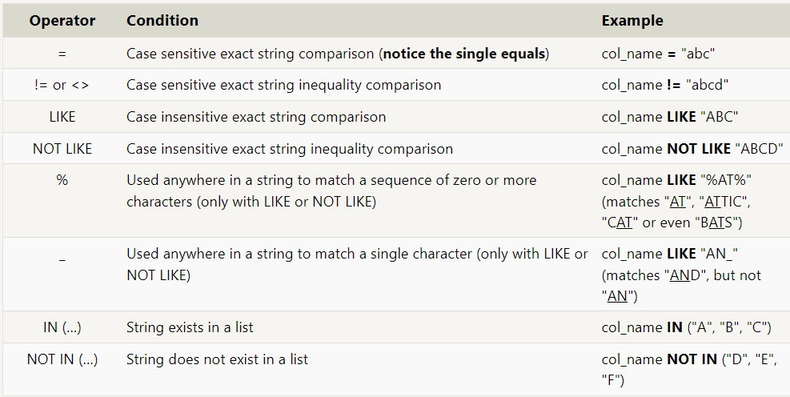
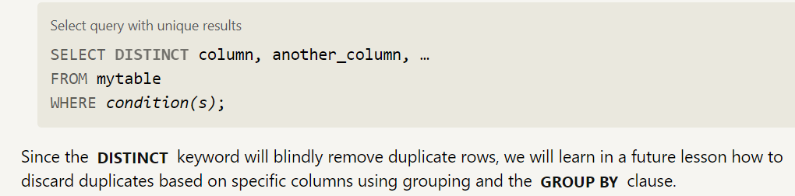
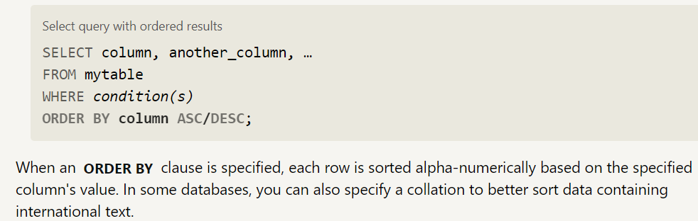
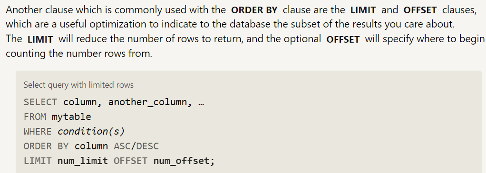

> " % "----->

> "\_" ------>

> "="------>

> "LIKE"------>
> "distinct"------> duplicate rows will be identified

### Why we should not use duplicate values in tables and why use joins?

> Inconsistency in data, one is updated and one is not updated, when sql crashes

> Avoid the anomaly

> Storage

## Keys

- Primary key

> Unique values

> cannot be null

> only one primary key in a table, no other columns can be the primary key

- Foreign key

> A foreign key in a database is a column or set of columns in one table that references the primary key in another table. It establishes a relationship between the two tables.

### Normalization

In a database, normalization involves organizing data into separate tables, each focusing on a specific type of information. This reduces redundancy and ensures that each piece of data is stored in one place only, making it easier to manage and preventing errors, reduce anamolies, increase the safety.

> SAFETY

reduce the anomaly

We wont mess up the data

#### 1NF

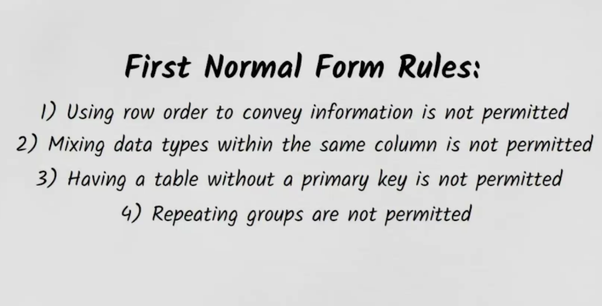

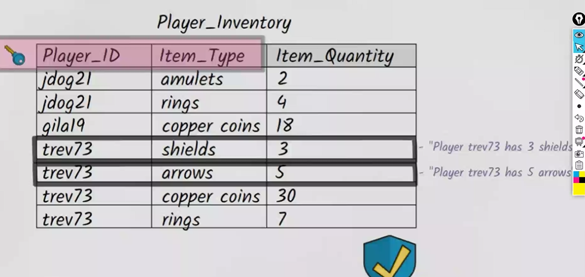

composite key--> combining two colimns to make it a primary key

#### 2NF

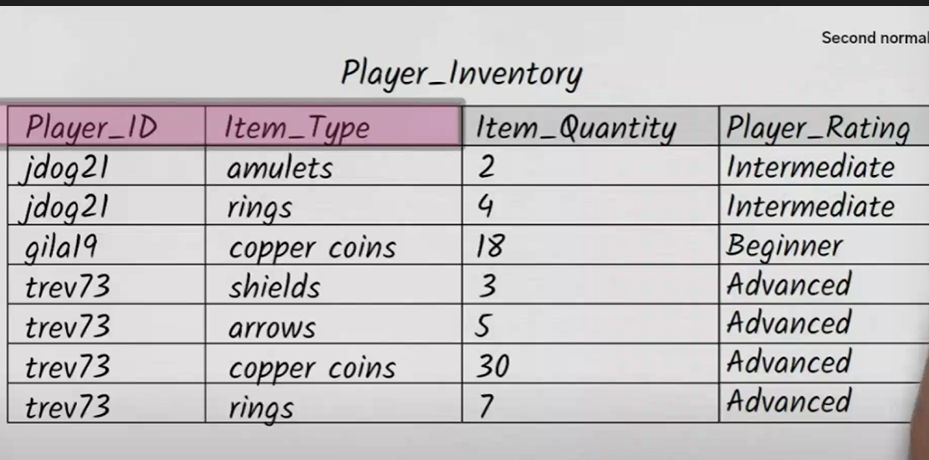

data is not safe here, its inconsistant,
it becomes updation anomaly

Avoiding this problem

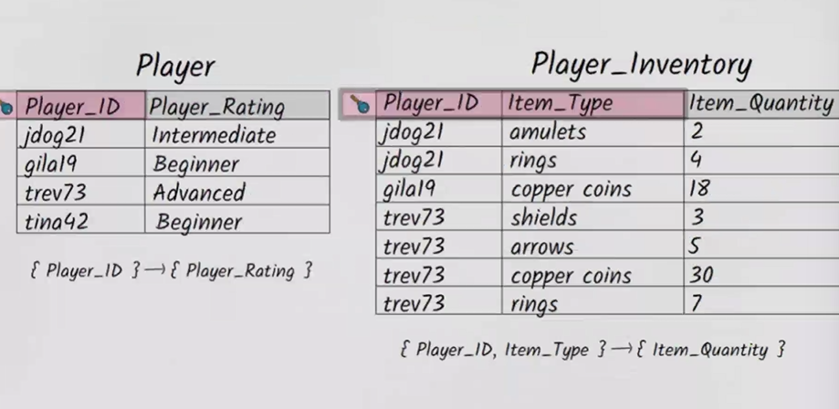

Deletion Anomaly:
If we want to remove two columns of trev other two

Each non key attribute must be dependent on the `entire` primary key in the 2NF

it should be in first normal form and second normal form

#### 3NF

lesser updates more safer data


there shouldnot be any dependency between the non key attributes

## JOINS

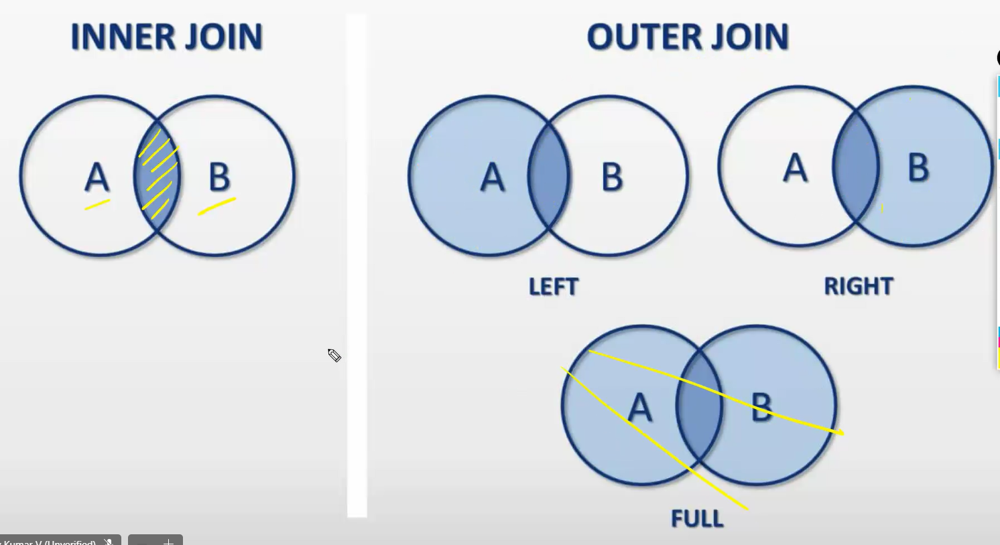

we always compare primary key to foreign key in joins

To view the result we need to join.

Every position, every place, in question if they ask every use `group by`

when ever we want to drill down to the next session we use group by

###### Aggregation = visualization purposes

> **Where and Having** difference is we cannot use Where after group by function, so we use the having function.

### Data types

> integer

> boolean

> float

> double

> real

> character(num_chars)-- Fixed length, padded with spaces if needed.

> varchar(num_chars)-- Variable length, more space-efficient for shorter strings.

> text--Variable length without maximum limit, suitable for longer strings., paragraphs

> date

> datetime

> blob-- to store large binary data, such as images, videos, audio files, and other multimedia objects. never store in blob store in file system.

1. INT (Integer):

- Storage: Typically occupies 4 bytes (32 bits) of storage space.
- Range: The range of values for an INT is from -2,147,483,648 to 2,147,483,647.
- Commonly used for storing integers within a moderate range.

2. SMALLINT (Small Integer):

- Storage: Typically occupies 2 bytes (16 bits) of storage space.
- Range: The range of values for a SMALLINT is from -32,768 to 32,767.
- Used when you know that the values stored in the column will be within a smaller range compared to INT.

3. BIGINT (Big Integer):

- Storage: Typically occupies 8 bytes (64 bits) of storage space.
- Range: The range of values for a BIGINT is from -9,223,372,036,854,775,808 to 9,223,372,036,854,775,807.
- Used when you need to store very large integer values that exceed the range of INT.

1. VARCHAR:

- Stands for "Variable Character."
- Stores character data using the database's default character encoding, which is typically a single-byte character set such as ASCII or UTF-8.
- Suitable for storing non-Unicode character data when the application or database primarily deals with single-byte character sets.

2. NVARCHAR:

- Stands for "Variable Character."
- Stores Unicode character data using the UTF-16 encoding, which allows it to support a wider range of characters including international characters, symbols, and emojis.
- Useful when you need to store data in multiple languages or when working with applications that require Unicode support.

1. decimal , float

depricated- outdated

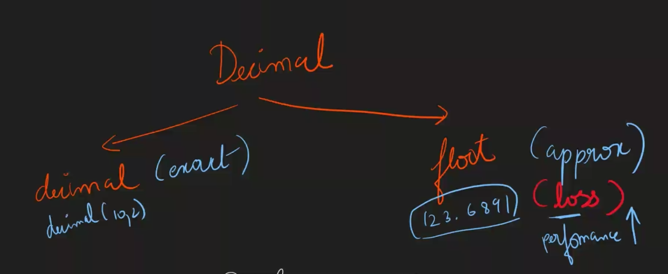

### constraints

1. Primary key

- uniquely identifies each record in a table
- not null
- only be one primary key constraint per table.

2. Auto increment - You dont to give an id , automatically increases the

3. unique

4. Not null

5. Foreign key- even if foreign key constraint is not there we can join tables why foreign key??

first delete the foreign key and then you can delete the primary key
when you want to insert a new row in the table, first insert in a primary key, foreign key helps to solve the error which has occured when the insertion happens

increasing the data safety

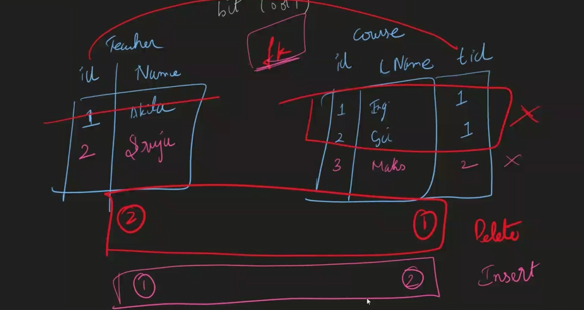

## multi level groupy

## set operstions in grouping

1. Union all doesnt know what columns it is combining it just combines the columns,
2. grouping sets

## cube vs rollup

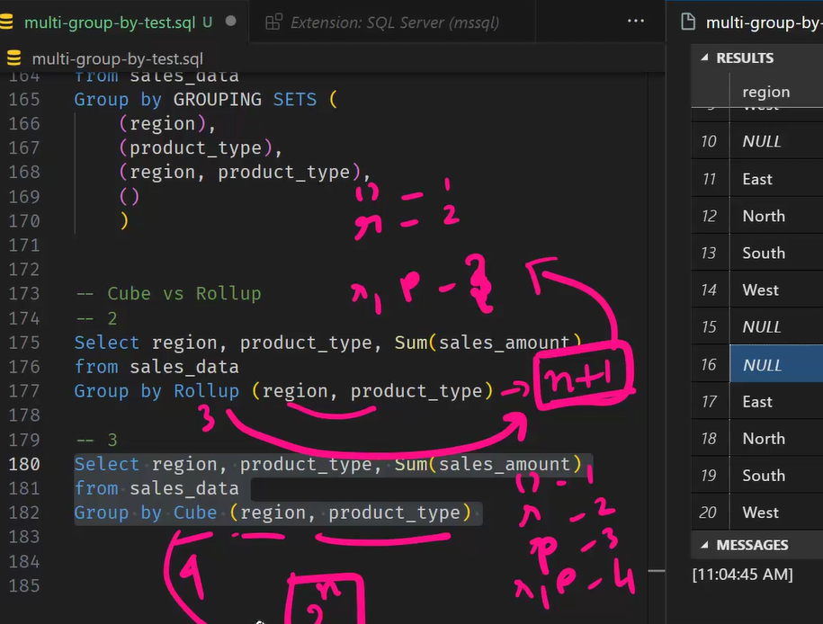

- # cube

- it is diff from the roll up in a way that, it groups by region first and then second it groups by the product_type, and then it takes the combine values
  and in grouping sets it gives the grand total , sum of the all rows

- 2^ n combinations if n= no of columns
- ## rollup

- rollup groups by first as one column and then it groups by the both other columns
- here first time it groups by the region and then region, product_type

- if you give the n columns it gives the n+1 columns

## Rank

- Rank

> ```sql
> RANK ( ) OVER ( [ partition_by_clause ] order_by_clause )
> ```

- Row_number

- Dense

> This function returns the rank of each row within a result set partition, with no gaps in the ranking values. The rank of a specific row is one plus the number of distinct rank values that come before that specific row.

```sql
DENSE_RANK() over ([partition by '   ' order by '     '])
```

- Ntile

## Why design

- to bring everyone on same page( developers)
- idea
- multiple variants of the same design

## Er diagrams

| TransactionID | Date | ProductName | Category | Price | StoreName | City | Country |

|---------------|------------|-------------|-----------|-------|-----------|------------|---------|

| 1 | 2024-04-01 | Laptop | Electronics | 1200 | TechWorld | San Francisco | USA |

| 2 | 2024-04-01 | Smartphone | Electronics | 800 | TechWorld | San Francisco | USA |

| 3 | 2024-04-02 | Jeans | Apparel | 40 | FashionFiesta | New York | USA |


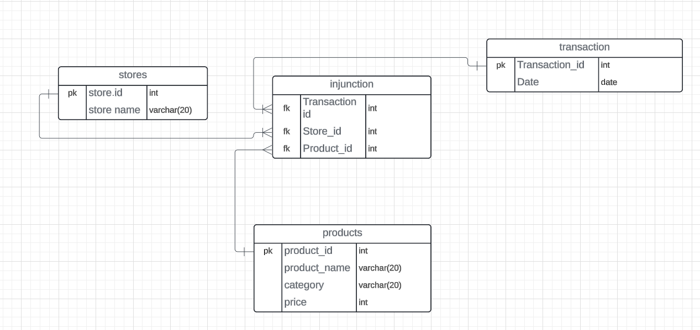

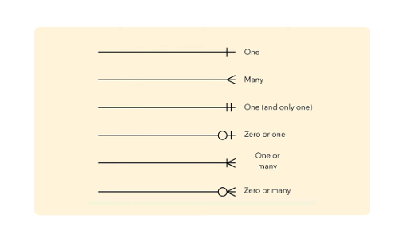

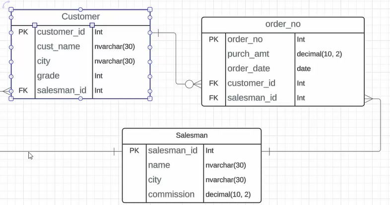

## XML

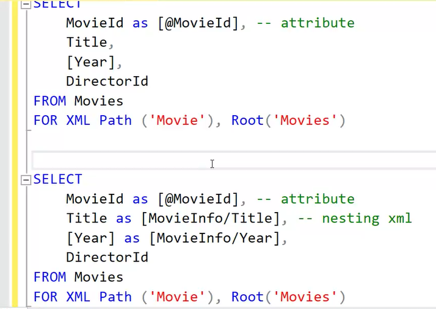

```xml

SELECT *

FROM Movies

FOR XML Auto
```

```xml

SELECT *

FROM Movies

FOR XML Path


SELECT

MovieId,

Title,

[Year],

DirectorId

FROM Movies

FOR XML Path

SELECT

	MovieId,

	Title,

	[Year],

	DirectorId

FROM Movies

FOR XML Path ('Movie')


SELECT

	MovieId,

	Title,

	[Year],

	DirectorId

FROM Movies

FOR XML Path ('Movie'), Root


SELECT

	MovieId,

	Title,

	[Year],

	DirectorId

FROM Movies

FOR XML Path ('Movie'), Root('Movies')

SELECT

	MovieId as [@MovieId], -- attribute

	Title as [MovieInfo/Title], -- nesting xml

	[Year] as [MovieInfo/Year],

	DirectorId

FROM Movies

FOR XML Path ('Movie'), Root('Movies')
```

## JSON

There is no attribute in json

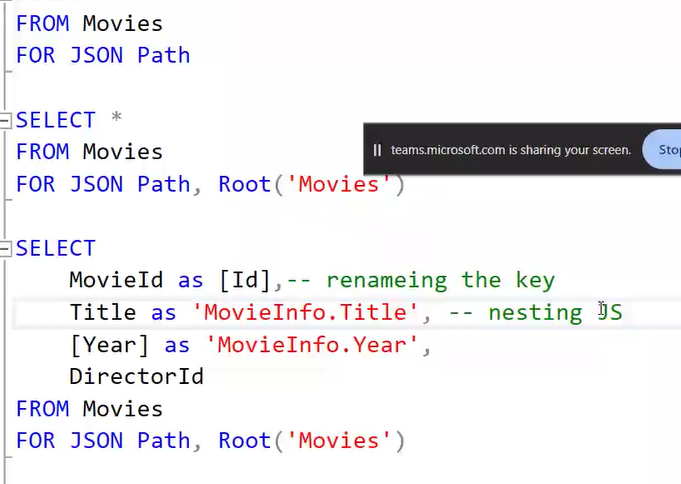

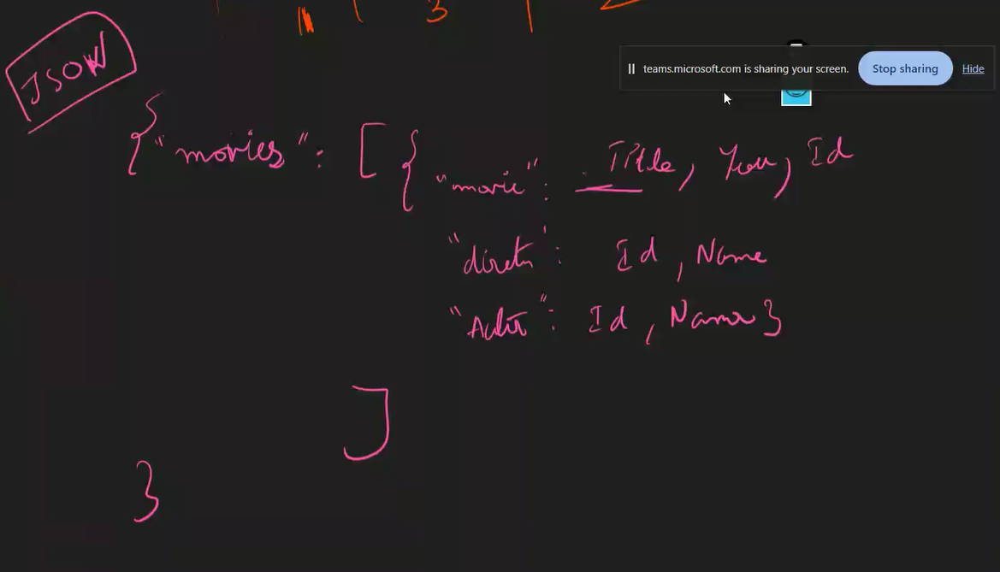

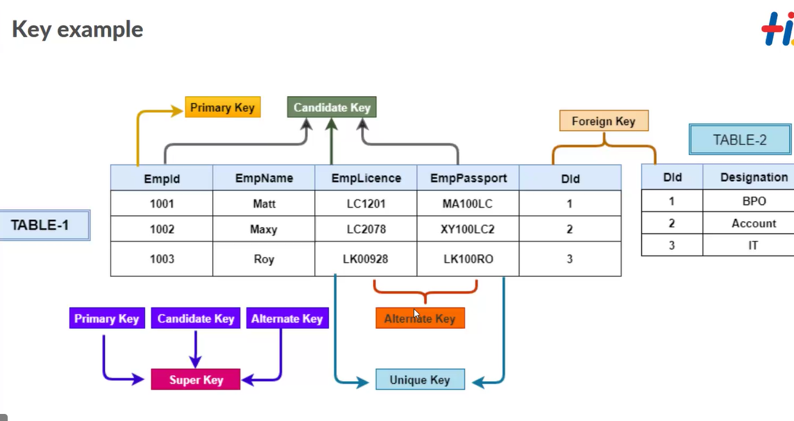

candidate key-- capability to become the primary key

alternate key-- which can be the next primary key

Super key-- primary key + any other alternate key is the super key

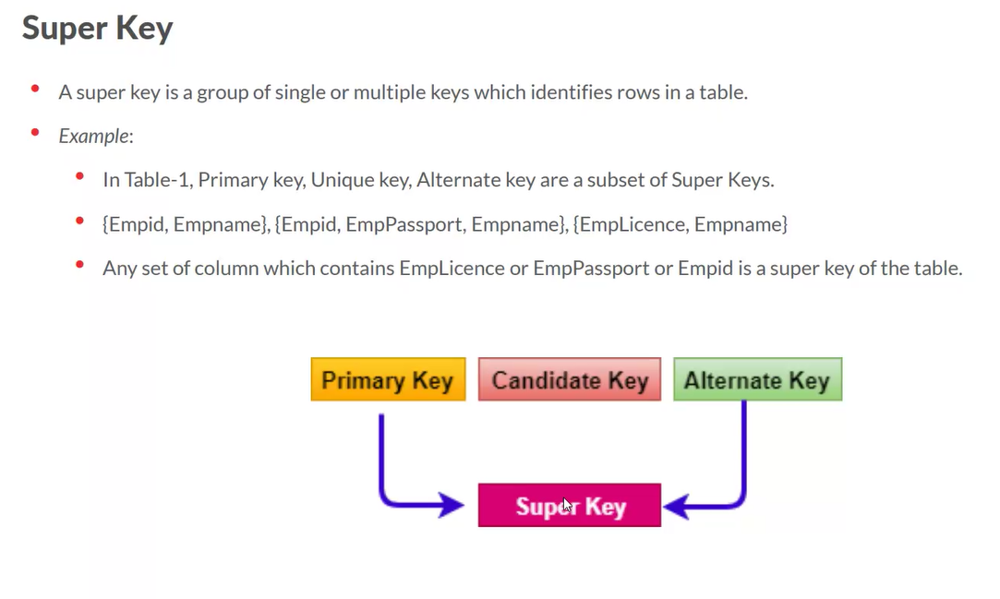
